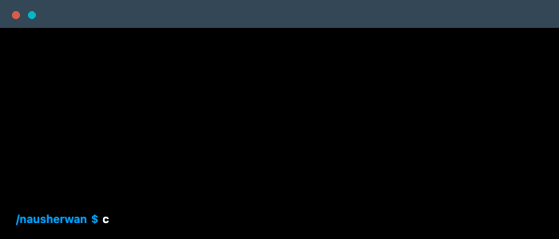

 

    

### Main Skills

### Summary of Qualifications
* **Full-Stack Development**: 1+ years of experience in web engineering and infrastructure monitoring.
* **Performance Focused**: Achieved a 95+ Lighthouse score for the AirFler landing page.
* **Operational Efficiency**: Reduced technical incident resolution time by ~35% through custom SOPs.
* **Crisis Management**: Provided 24/7 incident response for 150+ users as a Residence Assistant.

### Certifications
* **IBM** Cybersecurity Analyst
* **Google** Cybersecurity Professional
* **Google** Project Management

### Connect with me!

    
    

### Employer?
> [!IMPORTANT]  
> [Download My Resume](YOUR-RESUME-LINK-HERE)

